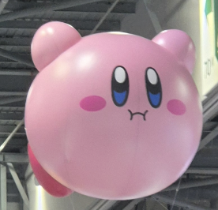

# pokemon-classification
A pokemon classification!

## Getting Started

Install python & etc.

## Usage

```bash
python classify.py <image file name>
```

Output: ('pokemon name', expected probability to be correct)

### Example 1

Example: `python classify.py sample.png`


Sample Output: `('Venusaur', 0.5306184)`


Note: Google Venusaur


### Example 2

Example: `python classify.py samples/flying-kirby.png`


Sample Output: `('Clefairy', 0.9496465)`

Note: Google Clefairy


### Example 3

Example: `python classify.py samples/좋빠가.gif `


Sample Output: `('Kingler', 0.2107012)`

Note: Google Kingler


## Objective

Classify a given image into a pokemon. It's fun!

e.g. Kirby, a person, etc.

## Implementation Strategy

1. Use available datasets here:
   - ~~https://www.kaggle.com/datasets/hlrhegemony/pokemon-image-dataset~~
   - https://www.kaggle.com/datasets/lantian773030/pokemonclassification
2. Use the CNN model I learned in AIP2 recently.
3. Use the pretrained model VGG-16 in image identification.

## Challenges and Overcoming

- Image preprocessing
  - Challenges: I had a hard time facing challenges on how to resize the image data.
  - Overcoming: I used ChatGPT to overcome this issue. (The '0. Data Preparation' describes this.)
- Training Speed
  - Challenges: I did not notice that the Colab would be more faster than my Jupyter Notebook.
  - Overcoming: Noticed after trying and experiencing.
- Limited Data
  - Challenges: there were 10000 images with 901 pokemons (not sure now...), which seems to be a small amount of data.
  - Overcoming: I tried to use the VGG-16 to overcome this issue!
- Loading drive data into colab notebook
  - Challenges: This takes like 6'53" or so in colab, while it takes much much less in the local desktop.
  - Overcoming: Ask GPT for a parallel loading code, and waited...
- Too low performance + overfitting
  - Challenges: It still had too low performance
  - Overcoming: Train + data cleaning (wipe out the data with only 5 data or so: one site had a lot of data (at least about 15) for all labeled pokemons there; others had like about 5 or so.) (in progress)

## Things to Boast

I had never tried CNN or image resizing myself (actually I have a homework related, but not yet finished...LOL), but I made it! \
Although it had 70% validation accuracy and 40% test accuracy, it did seem to work as intended!

## Future Development

After application into a phone app, taking picture and see which pokemon it matches and show the images, I am sure it would be more fun, accessible, and enjoyable! Model improvement would also be great, if possible.

